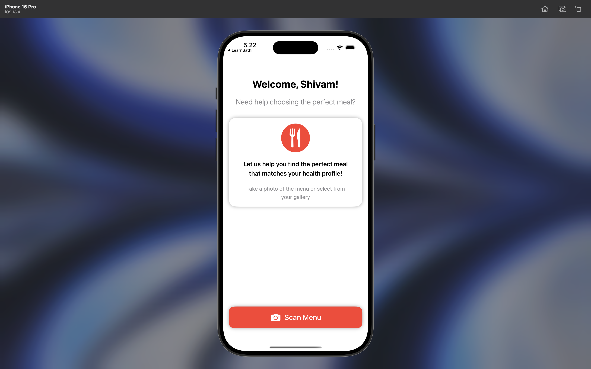

#  NutriGuard 
An iOS app that helps people with dietary restrictions confidently navigate restaurant menus. Winner of **Nagarro's Crack-a-Code Hackathon**.

NutriGuard eliminates dining confusion by providing instant, personalized menu recommendations based on your specific dietary needs and restrictions.

## Features
- Smart menu scanning with camera
- Personalized dietary restriction profiles
- Real-time menu item recommendations
- Ingredient analysis and safety alerts
- Restaurant database integration
- Offline mode support

## Screenshots
 

## Demo Video

*Watch NutriGuard help navigate real restaurant menus*

---
**Built with Swift, SwiftUI, Core ML, Gemini_API and Supabase**
